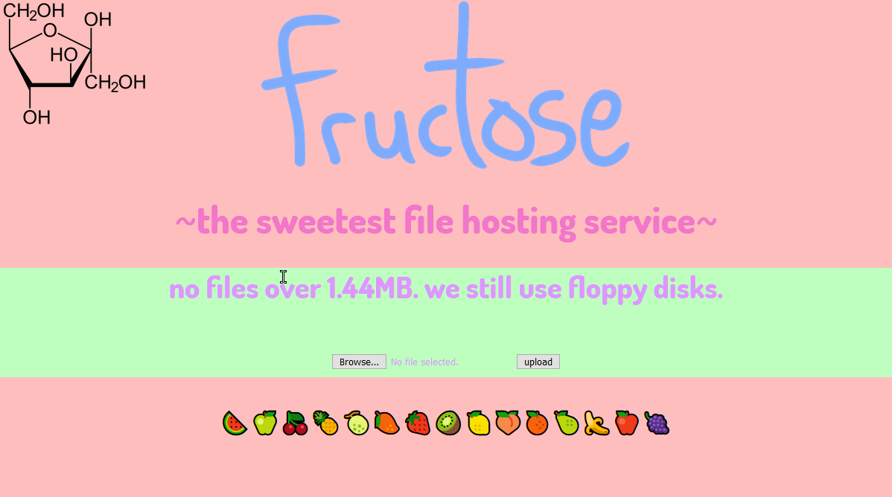

# fructose
🍉The sweetest file hosting service



## What is fructose?
> Fructose, or fruit sugar, is a simple ketonic monosaccharide found in many plants

And we chose fructose to be the name of our file hosting server (pomf clone).
It is written in HTML, CSS, and Python 3 with Flask.

## Install
```commandline
# Clone the repo
git clone https://github.com/woke-oats/fructose

# Create a virtual environment
python3 -m venv venv

# Install requirements
pip3 install -r requirements.txt
```

## To Run
```commandline
python3 app.py
```

## Credits
Made by [prydt](https://github.com/prydt) and [NitroGuy10](https://github.com/NitroGuy10).

AGPL3 licensed.